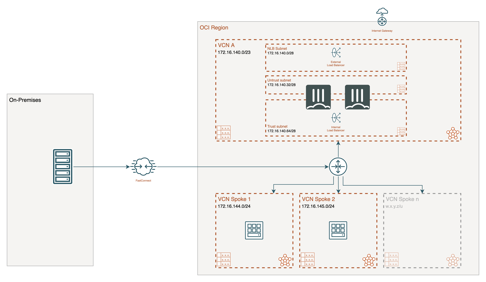
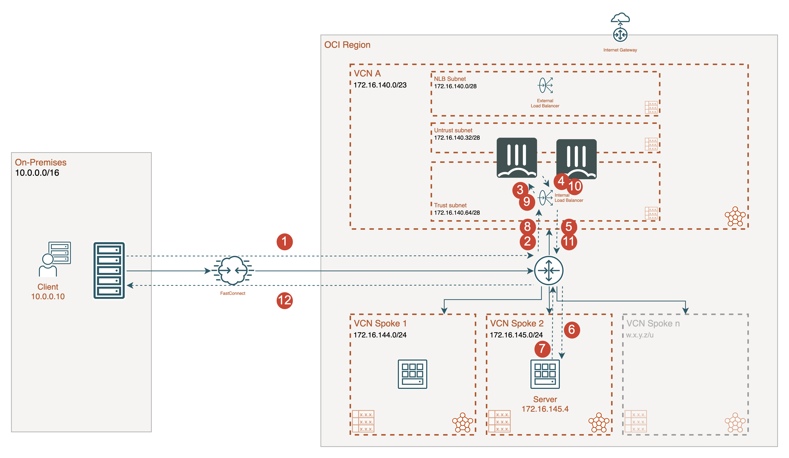
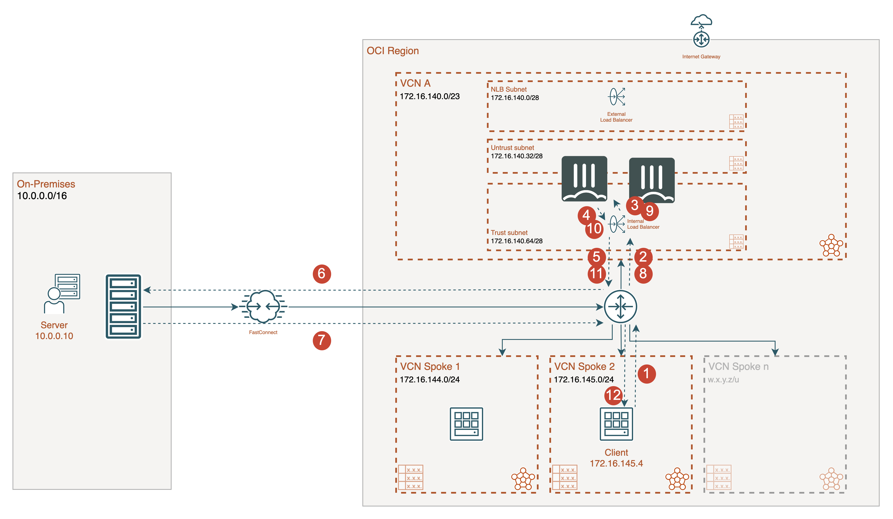
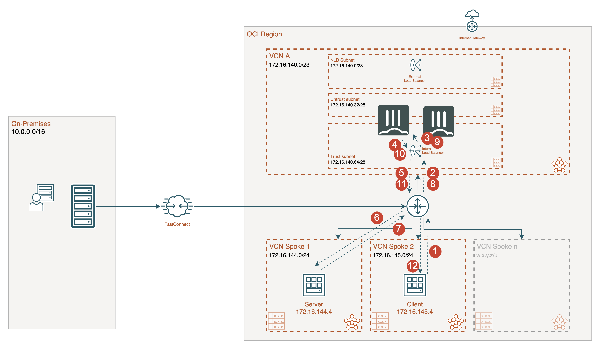

# DRGv2 Hub and Spoke using Active/Active loadbalanced pair of standalone FortiGate VMs

## Introduction

This architecture combines the Dynamic Routing Gateway (DRGv2) functionality with the FortiGate VMs to create a Hub and Spoke topology for traffic inspection. In this design, the FortiGate VMs are in Active/Active mode to provide additional capacity. To direct traffic to one of the FortiGate VMs a Flexible Netowork Load Balancer is used as an internal load balancer. The Load Balancer acts as a non-proxy layer-4 load balancer forwarding all udp/tcp/icmp traffic.

There are several blog posts and documentation that formed the basis of this design:

- [DRGv2 Hub and Spoke: HUB NVA inspecting the traffic](https://www.ateam-oracle.com/post/drgv2-hub-and-spoke-hub-nva-inspecting-the-traffic)
- [Announcing Oracle Cloud Infrastructure Flexible Network Load Balancer](https://blogs.oracle.com/cloud-infrastructure/post/announcing-oracle-cloud-infrastructure-flexible-network-load-balancer)
- [Fortinet and Oracle Cloud Infrastructure partnership on the Flexible Network Load Balancer](https://www.fortinet.com/blog/business-and-technology/fortinet-and-oracle-cloud-infrastructure-partnership-offers-customers-reliable-cloud-security-performance)

## Design

In Oracle Cloud Infractructure, the combination of the DRGv2 and the Flexible Load Balancer offers an extensible setup for traffic inspection of the following flows:

- East-West traffic between spokes VCNs connected to the DRGv2 or to the Hub via Local Peering Gateway (LPG)
- Traffic FastConnect or IPSEC VPN branch sites connected to the DRGv2
- North-South traffic coming from the internet via the external flexible network load balancer into one of the available FortiGate VMs to a workload in a spoke.

This Terraform template will deploy a full working environment containing the following components.

- 2 standalone FortiGate firewall
- 3 Virtual Cloud Networks (VCN) (1 Hub and 2 Spokes)
- 1 Dynamic Routing Gateway (DRGv2)
- 2 Flexible Network Load Balancers (external and internal)
- All routing attachments and routing tables
- FortiGate configuration and firewall rules



## Deployment

For the deployment, you can use the the OCI Portal or Terraform. This set of terraform templates is specific for Oracle Cloud Infrastructure. The main template is the `main.tf` with different additional template files. You'll be prompted to provide a prefix and credentials to connect to OCI for  required variables:

- prefix : This prefix will be added to each of the resources created by the template for ease of use and visibility
- region : This is the OCI region where the template will be deploy the resources.
- compartment_ocid: id of the compartment to deploy the resources in
- Authentication using API key: tenancy_ocid, user_ocid, private_key_path, fingerprint ([more info](https://docs.oracle.com/en-us/iaas/Content/API/SDKDocs/terraformproviderconfiguration.htm))

### Oracle Cloud Portal

[](https://cloud.oracle.com/resourcemanager/stacks/create?zipUrl=https://github.com/40net-cloud/fortinet-oci-solutions/releases/download/artefacts/terraform-drgv2-hubspoke.zip)

### Terraform

The terraform binary is available form different operating systems and can be downloaded [here](https://www.terraform.io/).

1. Clone the repository: git clone https://github.com/40net-cloud/fortinet-oci-solutions
2. Customize variables in the `terraform.tfvars.example` and `variables.tf` file as needed.  And rename `terraform.tfvars.example` to `terraform.tfvars`.
3. Optional copy the license files referenced in the variables.tf file to this directory.
4. Initialize the providers and modules:
   ```sh
   $ cd XXXXX
   $ terraform init
    ```
5. Submit the Terraform plan:
   ```sh
   $ terraform plan
   ```
6. Verify output.
7. Confirm and apply the plan:
   ```sh
   $ terraform apply
   ```
8. If output is satisfactory, type `yes`.

Output will include the information necessary to log in to the FortiGate-VM instances:
```sh
Default_Password = [
  "<FGT Password>",
]
Default_Username = admin
FGTAMGMTPublicIP = [
  "<FGT Active Public IP>",
]
FGTBMGMTPublicIP = [
  "<FGT Passive Public IP>",
]
```
*After deployment, FortiGate-VM instances may not get the proper configurations during the initial bootstrap configuration.
User may need to do a manual factoryreset on the units in order to get proper configurations.  To do factoryreset, user can
login to the units via Console, and do `exec factoryreset`*

#### Destroy the instance
To destroy the instance, use the command:
```sh
$ terraform destroy
```
## Requirements and limitations

The terraform template deploys different resources and it is required to have the access rights and quota in your Oracle Cloud subscription to deploy the resources.

- Terraform requirements:
  - [Terraform](https://learn.hashicorp.com/terraform/getting-started/install.html) >= 1.0.9
  - Terraform Provider OCI >= 4.50
  - Terraform Provider Template >= 2.2.0
  - A [OCI API key](https://docs.cloud.oracle.com/en-us/iaas/Content/API/Concepts/apisigningkey.htm)
- Due to the limitation of the Flexible Network Load Balancer in OCI all traffic needs to be address translated NAT behind the FortiGate. If the SNAT is not performed a session is not symmetrical in the Flexible Network Load Balancer.
- The template will deploy VM Standard E3 Flex with 4oCPUs and 16Gb RAM. Other VM instances are supported as well with a minimum of 2 NICs. A list can be found [here](https://docs.fortinet.com/document/fortigate-public-cloud/7.2.0/oci-administration-guide/456256/instance-type-support)
- Licenses for Fortigate
  - BYOL: A demo license can be made available via your Fortinet partner or on our website. These can be injected during deployment or added after deployment. Purchased licenses need to be registered on the [Fortinet support site](http://support.fortinet.com). Download the .lic file after registration. Note, these files may not work until 60 minutes after it's initial creation.
  - BYOL Flex-VM: This BYOL license is also available and requires a token to be provisioned before deployment. The tokens can be provided during deployment in the variables 'fgt_byol_flexvm_license_a' and 'fgt_byol_flexvm_license_b'. Or the tokens can be activated after deployment using the CLI command 'exec vm-license <vm token>'
  - PAYG or OnDemand: These licenses are automatically generated during the deployment of the FortiGate systems.
- To change the deployed version of FortiGate the variables below need to be updated in the variables.tf file:
  - Marketplace Catalog for mp_listing_id in variables.tf
    - BYOL 7.2.0: ocid1.image.oc1..aaaaaaaapxqi6j4dq2tl3yz4h7tqz7oqaqzcvr5renzczzeiptvk3slhcmba
  - Marketplace Image for mp_listing_resource_id in variables.tf
    - PAYG 7.2.0 2ocpu: ocid1.image.oc1..aaaaaaaa3haefpqg7myrwrc6ixslki62b4iu6nsejbxaqfum4f5cmtv2obwq
    - PAYG 7.2.0 4ocup: ocid1.image.oc1..aaaaaaaagf4ivombrtebdq76lykd7mfk2grh5kckrquqi7v7pyfden3ftloq
    - PAYG 7.2.0 8ocup: ocid1.image.oc1..aaaaaaaarweyb4lbe3kntrn5dgg5xrklua4jwqgom66iyt46wppfwakkzjta
    - PAYG 7.2.0 24ocup: ocid1.image.oc1..aaaaaaaariewc5zd6lkasnz4qwc6wslhfsb5wzo56r7d6w4vzztbzkajrowq

## Configuration

### FortiGate

##### FortiGate A

```
config system global
  set hostname PREFIX-fgta
end
config system sdn-connector
  edit oci-sdn
    set type oci
    set use-metadata-iam enable
  next
end
config system probe-response
  set http-probe-value OK
  set mode http-probe
end
config system interface
  edit port1
    set alias untrusted
    set mode static
    set ip 172.16.140.35/28
    set allowaccess ping https ssh fgfm probe-response
  next
  edit port2
    set alias trusted
    set mode static
    set ip 172.16.140.67/28
    set allowaccess ping https ssh fgfm probe-response
  next
end
config router static
  edit 1
    set device port1
    set gateway 172.16.140.33
  next
  edit 2
    set device port2
    set dst 172.16.140.0/22
    set gateway 172.16.140.65
  next
  edit 3
    set device port2
    set dst 172.16.144.0/24
    set gateway 172.16.140.65
  next
  edit 4
    set device port2
    set dst 172.16.145.0/24
    set gateway 172.16.140.65
  next
end
config firewall policy
  edit 1
    set name "DRG traffic"
    set srcintf "port2"
    set dstintf "port2"
    set action accept
    set srcaddr "all"
    set dstaddr "all"
    set schedule "always"
    set service "ALL"
    set nat enable
  next
end
```

##### FortiGate B

```
config system global
  set hostname PREFIX-fgtb
end
config system sdn-connector
  edit oci-sdn
    set type oci
    set use-metadata-iam enable
  next
end
config system probe-response
  set http-probe-value OK
  set mode http-probe
end
config system interface
  edit port1
    set alias untrusted
    set mode static
    set ip 172.16.140.36/28
    set allowaccess ping https ssh fgfm probe-response
  next
  edit port2
    set alias trusted
    set mode static
    set ip 172.16.140.68/28
    set allowaccess ping https ssh fgfm probe-response
  next
end
config router static
  edit 1
    set device port1
    set gateway 172.16.140.33
  next
  edit 2
    set device port2
    set dst 172.16.140.0/22
    set gateway 172.16.140.65
  next
  edit 3
    set device port2
    set dst 172.16.144.0/24
    set gateway 172.16.140.65
  next
  edit 4
    set device port2
    set dst 172.16.145.0/24
    set gateway 172.16.140.65
  next
end
config firewall policy
  edit 1
    set name "DRG traffic"
    set srcintf "port2"
    set dstintf "port2"
    set action accept
    set srcaddr "all"
    set dstaddr "all"
    set schedule "always"
    set service "ALL"
    set nat enable
  next
end
```

### OCI


## Flows

### On-premises to Spoke



1. Connection from the on-premises client to OCI via FastConnect to the DRGv2 - s: 10.0.0.10 - d: 172.16.145.4
2. The DRGv2 routing table on the FastConnect or VPN Gateway attachment directs the traffic to the DRG Hub attachment. The VCN Route table assigned to the DRG Hub attachment points all traffic to the internal load balancer - s: 10.0.0.10 - d: 172.16.145.4
3. The internal load balancer sends the traffic to one of the backend FortiGate VM that is available - s: 10.0.0.10 - d: 172.16.145.4
4. The FortiGate VM inspects the packet and translates the source IP (SNAT) to the IP address of port2 - s: 172.16.140.68 - d: 172.16.145.4
5. The packet leaving the FortiGate VM is routed using the VCN route table on the subnet back to the DRGv2 - s: 172.16.140.68 - d: 172.16.145.4
6. The DRGv2 sends the packet to the Spoke 2 DRGv2 attachment and up the network stack of the server VM - s: 172.16.140.68 - d: 172.16.145.4
7. The server VM reponds and the reponse packet is routed back via the VCN route table to the DRGv2 - s: 172.16.145.4 - d: 172.16.140.68
8. The return packet is routed back to the internal load balancer in the Hub - s: 172.16.145.4 - d: 172.16.140.68
9. The internal load balancer routes the packet back to the FortiGate VM - s: 172.16.145.4 - d: 172.16.140.68
10. The FortiGate VM inspects the return packet and removes the SNAT - s: 172.16.145.4 - d: 10.0.0.10
11. The return packet is routed back to the DRGv2 using the VCN route table - s: 172.16.145.4 - d: 10.0.0.10
12. The DRGv2 routes the packet back to FastConnect and to the customers on-premise location - s: 172.16.145.4 - d: 10.0.0.10

### Spoke to on-premises



1. Connection from spoke 2 client to DRG via the VCN route table - s: 172.16.145.4 - d: 10.0.0.10
2. The DRG routing table on the spoke attachment directs the traffic to the DRG Hub attachment. The VCN Route table assigned to the DRG Hub attachment points all traffic to the internal load balancer - s: 172.16.145.4 - d: 10.0.0.10
3. The internal load balancer sends the traffic to one of the backend FortiGate VM that is available - s: 172.16.145.4 - d: 10.0.0.10
4. The FortiGate VM inspects the packet and translates the source IP (SNAT) to the IP address of port2 - s: 172.16.140.68 - d: 10.0.0.10
5. The packet leaving the FortiGate is routed using the VCN route table on the subnet back to the DRG - s: 172.16.140.68 - d: 10.0.0.10
6. The DRG sends the packet to the FastConnect DRG attachment and towards the server on-premises - s: 172.16.140.68 - d: 10.0.0.10
7. The server VM reponds and the reponse packet is routed back via FastConnect and the DRG Route table to the DRG - s: 10.0.0.10 - d: 172.16.140.68
8. The return packet is routed back to the internal load balancer in the Hub - s: 10.0.0.10 - d: 172.16.140.68
9. The internal load balancer routes the packet back to the FortiGate VM - s: 10.0.0.10 - d: 172.16.140.68
10. The FortiGate VM inspects the return packet and removes the SNAT - s: 10.0.0.10 - d: 172.16.145.4
11. The return packet is routed back to the DRGv2 using the VCN route table - s: 10.0.0.10 - d: 172.16.145.4
12. The DRGv2 routes the packet back to spoke attachment and the client VM - s: 10.0.0.10 - d: 172.16.145.4

### Spoke to spoke



1. Connection from spoke 2 client to DRG via the VCN route table - s: 172.16.145.4 - d: 172.16.144.4
2. The DRG routing table on the spoke attachment directs the traffic to the DRG Hub attachment. The VCN Route table assigned to the DRG Hub attachment points all traffic to the internal load balancer - s: 172.16.145.4 - d: 172.16.144.4
3. The internal load balancer sends the traffic to one of the backend FortiGate VM that is available - s: 172.16.145.4 - d: 172.16.144.4
4. The FortiGate VM inspects the packet and translates the source IP (SNAT) to the IP address of port2 - s: 172.16.140.68 - d: 172.16.144.4
5. The packet leaving the FortiGate VM is routed using the VCN route table on the subnet back to the DRG - s: 172.16.140.68 - d: 172.16.144.4
6. The DRG sends the packet to the Spoke1 DRG attachment and towards the server - s: 172.16.140.68 - d: 172.16.144.4
7. The server VM reponds and the reponse packet is routed back via the VCN and DRG Route table to the DRG - s: 172.16.144.4 - d: 172.16.140.68
8. The return packet is routed back to the internal load balancer in the Hub - s: 172.16.144.4 - d: 172.16.140.68
9. The internal load balancer routes the packet back to the FortiGate VM - s: 172.16.144.4 - d: 172.16.140.68
10. The FortiGate VM inspects the return packet and removes the SNAT - s: 172.16.144.4 - d: 172.16.145.4
11. The return packet is routed back to the DRGv2 using the VCN route table - s: 172.16.144.4 - d: 172.16.145.4
12. The DRGv2 routes the packet back to spoke attachment and the client VM - s: 172.16.144.4 - d: 172.16.145.4

## Links and documentation

- [Dynamic Routing Gateways (DRGs)](https://docs.oracle.com/en-us/iaas/Content/Network/Tasks/managingDRGs.htm#overview)
- [Flexible Network Load Balancer](https://docs.oracle.com/en-us/iaas/Content/NetworkLoadBalancer/overview.htm)
- [Fortinet and Oracle Cloud Infrastructure](https://docs.fortinet.com/cloud-solutions/oci)

## Support
Fortinet-provided scripts in this and other GitHub projects do not fall under the regular Fortinet technical support scope and are not supported by FortiCare Support Services.
For direct issues, please refer to the [Issues](https://github.com/40net-cloud/fortigate-oci-solutions/issues) tab of this GitHub project.
For other questions related to this project, contact [github@fortinet.com](mailto:github@fortinet.com).

## License
[License](LICENSE) © Fortinet Technologies. All rights reserved.
